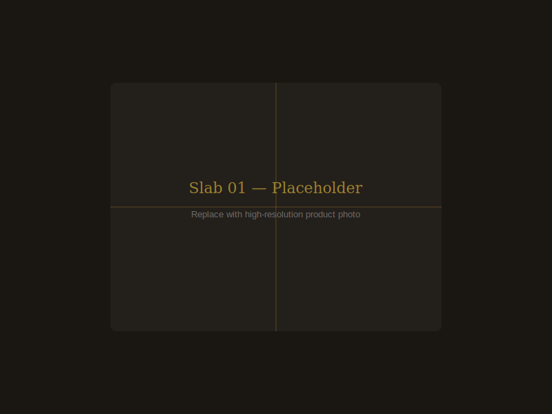

# Cleopatra Delights — Floating Architecture Scaffold

> **This is a visual & interaction scaffold.**  
> Images in `assets/` are placeholder SVGs and **must** be replaced with
> high-quality, cohesively-toned photographs before going live.

---

## Quick Start

### Option A — Python (no install required)

```bash
cd cleopatra-delights
python3 -m http.server 8080
# Open http://localhost:8080 in your browser
```

### Option B — VS Code Live Server

1. Install the [Live Server](https://marketplace.visualstudio.com/items?itemName=ritwickdey.LiveServer) extension.
2. Right-click `index.html` → **Open with Live Server**.

### Option C — Node `serve`

```bash
npx serve cleopatra-delights
```

> **Note:** The site must be served over HTTP (not opened as a `file://` URL)
> for `IntersectionObserver` and `fetch` calls to behave correctly in all browsers.

---

## Folder Structure

```
cleopatra-delights/
├── index.html        # Full page scaffold (5 sections)
├── styles.css        # All styles — design tokens in :root custom properties
├── app.js            # Interactions: reveal, slab tilt, parallax, countdown
├── README.md         # This file
└── assets/
    ├── README.md     # Asset replacement guide + tone guidelines
    ├── hero-texture.svg   # Seamless architectural grid (replace optionally)
    ├── slab-1.svg    ┐
    ├── slab-2.svg    │  Floating slab card images — replace with
    ├── slab-3.svg    │  800 × 600 px+ high-res product photos
    ├── slab-4.svg    │
    ├── slab-5.svg    │
    ├── slab-6.svg    ┘
    ├── drop-1.svg    ┐
    ├── drop-2.svg    │  Tonight's Drop card images — replace with
    └── drop-3.svg    ┘  600 × 600 px+ square product photos
```

---

## Design Tokens

All visual parameters live in `styles.css` under `:root` and can be tuned
without touching any layout or JavaScript.

| Token | Purpose |
|-------|---------|
| `--clr-bg` | Page background (deep matte charcoal) |
| `--clr-gold` | Primary accent colour |
| `--shadow-lg` / `--shadow-xl` | Floating layer depth shadows |
| `--dur-reveal` | Scroll-reveal animation duration |
| `--dur-hover` | Hover transition duration |
| `--reveal-y` | Upward travel distance on reveal |
| `--max-w` | Maximum content width (1200 px) |

---

## Motion System

- **Reveal:** `.reveal` elements transition from `opacity: 0` + `translateY(var(--reveal-y))`
  to fully visible as they enter the viewport via `IntersectionObserver`.
- **Slab tilt:** Perspective 3-D tilt on `mousemove` driven by `requestAnimationFrame`
  with lerp smoothing; max ±4°.
- **Slab parallax:** Gentle scroll parallax (6% strength) applied via a CSS custom
  property `--parallax-y`, updated on `scroll` with `requestAnimationFrame`.
- **Countdowns:** `setInterval` (1 s) ticks; target date set via `data-target` attribute.
- All motion **respects `prefers-reduced-motion: reduce`** — transitions collapse to
  instant and tilt/parallax are disabled.

---

## Replacing Placeholder Assets

1. Prepare images following the tone guide in `assets/README.md`.
2. Export as JPEG or WebP for performance (`slab-*.jpg`, `drop-*.jpg`).
3. Update the `src` attributes in `index.html`:
   ```html
   <!-- Before -->
   

   <!-- After -->
   
   ```
4. Update `alt` text to accurately describe each photo.
5. Optionally add `srcset` / `sizes` for responsive images.

---

## Reviewer Notes

### Accessibility

- **Keyboard focus:** All interactive elements (`<a>`, `<button>`) have visible
  `:focus-visible` rings using `--clr-gold` colour (2 px offset outline).
- **Reduced motion:** `@media (prefers-reduced-motion: reduce)` in `styles.css`
  disables all CSS transitions and JS checks `window.matchMedia` at runtime.
- **Timer semantics:** Countdown wrappers use `role="timer"` and `aria-label`
  describing which product they belong to.
- **Decorative elements:** Hero background, divider icons, and scroll indicator
  carry `aria-hidden="true"`.
- **Alt text:** Placeholder `alt` attributes describe the expected content;
  update them when real images are added.

### Customisation Tips

- To change the drop countdown targets, update the `data-target` ISO datetime
  strings on `.countdown` elements in `index.html`.
- Tilt intensity can be reduced by lowering `MAX_TILT` in `app.js` (currently 4°).
- Parallax strength is controlled by `STRENGTH` in `app.js` (currently 0.06).
- Animation durations and delays are CSS custom properties — tune `--dur-reveal`
  and the `[data-delay]` modifier rules in `styles.css`.

### Known Limitations (scaffold scope)

- No backend / cart integration — "Reserve" buttons are placeholder `<a>` tags.
- Stock counts are static; connect to inventory API to make them live.
- Countdown target dates are hardcoded; they should be driven by a CMS or API.
